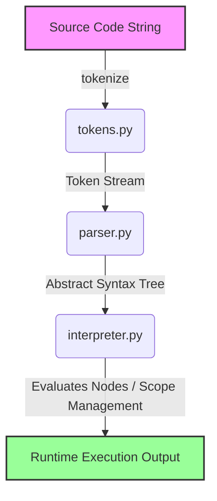

# 🛠️ Contributing to Tacx.IR

First off, thank you for taking the time to contribute to Tacx.IR! This document serves as a comprehensive guide to help you understand the codebase architecture, set up your development environment, and follow repository conventions when modifying the compiler or runtime.

---

## 📖 Table of Contents

1. [Development Philosophy](#-development-philosophy)
2. [Internal Pipeline Architecture](#-internal-pipeline-architecture)
3. [Step-by-Step Guide: Adding a New Language Feature](#-step-by-step-guide-adding-a-new-language-feature)
4. [Error Handling & Exceptions Standard](#-error-handling--exceptions-standard)
5. [Testing & Verification Standards](#-testing--verification-standards)
6. [Repository Conventions](#-repository-conventions)

---

## 🎯 Development Philosophy

When contributing changes to the Tacx.IR language, please keep the following guidelines in mind:
* **Focus & Simplicity**: Ensure code edits are focused and minimize unrelated changes.
* **Syntax Integrity**: Preserve the original Banglish syntax and behavior. Any changes that affect existing syntax must be backward-compatible with [`v2strengthtext.tacx`](v2strengthtext.tacx).
* **Testing First**: No feature is considered complete until it is accompanied by corresponding unit tests inside [`test_tacxIR.py`](test_tacxIR.py).

---

## 🏗️ Internal Pipeline Architecture

The execution of a Tacx.IR script flows through four primary stages, each isolated in a dedicated module within the [`tacxir`](tacxir/) package:



### Module Responsibilities
1. **[`tokens.py`](tacxir/tokens.py) (The Lexer)**: Uses regular expressions (`TOKEN_TYPES`) to transform the raw source code text into a sequence of structured `Token` instances, retaining character positions.
2. **[`ast_nodes.py`](tacxir/ast_nodes.py) (The AST)**: Declares class nodes representing grammar constructs (such as `BinOpNode`, `BoloStmt`, `RakhoStmt`). It also defines AST stringification methods for debugging and prints.
3. **[`parser.py`](tacxir/parser.py) (The Parser)**: Implements a recursive-descent parser, handling operator precedence (from logical OR down to primary terminals) and turning token lists into formal AST Nodes.
4. **[`interpreter.py`](tacxir/interpreter.py) (The Interpreter)**: Implements the `TacxIR` execution context. Manages lexical block scopes (`self.scopes`), loops, function definitions, standard error handling, and builtin routines.

---

## 🚀 Step-by-Step Guide: Adding a New Language Feature

Adding a new language feature or construct (for example, a new loop style, logical operator, or syntax sugar) is a structured process. Follow these 5 steps:

### Step 1: Declare the Lexer Token
Open [`tacxir/tokens.py`](tacxir/tokens.py). Add the new token type name and regular expression pattern to `TOKEN_TYPES`. If it is a keyword, use the `keyword_pattern` helper to prevent partial matching.
```python
# Example: Adding a "Koro" keyword
TOKEN_TYPES = [
    # ... other tokens ...
    ("KORO", keyword_pattern("Koro")),
    # ... other tokens ...
]
```

### Step 2: Implement the AST Node Class
Open [`tacxir/ast_nodes.py`](tacxir/ast_nodes.py). 
1. Create a corresponding class subclassing either `ASTNode` (for expressions) or `StmtNode` (for statements).
2. Register your node type inside the `ast_to_debug_lines` recursive debugger function so that `--dump-ast` outputs it correctly.
```python
class KoroStmt(StmtNode):
    def __init__(self, expr):
        self.expr = expr

# In ast_to_debug_lines():
if isinstance(node, KoroStmt):
    lines = [f"{pad}KoroStmt"]
    lines.extend(ast_to_debug_lines(node.expr, indent + 1))
    return lines
```

### Step 3: Implement Parser Rules
Open [`tacxir/parser.py`](tacxir/parser.py). Add a parsing routine in `parse_statement` or `parse_expression` (depending on the node category) to recognize the token and generate the AST node.
```python
# In parse_statement():
elif tok.type == "KORO":
    self.consume("KORO")
    expr = self.parse_expression()
    self.consume("SEMI")
    return KoroStmt(expr)
```

### Step 4: Implement Evaluation Logic
Open [`tacxir/interpreter.py`](tacxir/interpreter.py). 
* For statements: Add a handler in `execute(self, stmts)`.
* For expressions: Add a handler in `eval_expr(self, node)`.
```python
# In execute():
elif isinstance(stmt, KoroStmt):
    evaluated_val = self.eval_expr(stmt.expr)
    # Perform custom statement execution logic here...
```

### Step 5: Add Regression Tests
Open [`test_tacxIR.py`](test_tacxIR.py) and create a test case to cover both:
* **The Happy Path**: Correct usage and parsing.
* **The Error Boundaries**: Syntactically incorrect usages or invalid runtime inputs.

---

## ⚠️ Error Handling & Exceptions Standard

To maintain stability, the interpreter relies on specific error classes and exceptions:

### 1. Control-Flow Exceptions
We use Python exception bubbles to handle non-local runtime control transfer:
* **`ReturnException(value)`**: Bubbles return values out of active function stacks.
* **`BreakException`**: Bubbles break actions out of loop statements (`Thamo`).
* **`ContinueException`**: Bubbles continue actions to the top of loops (`Chalano`).

*Always wrap execution blocks with appropriate `try...except` filters to prevent these from leaking to global exit codes!*

### 2. Runtime and Parsing Errors
Raise standard Python built-in error types to match the interpreter's error catching blocks in the CLI:
* Raise **`SyntaxError`** for invalid lexical tokens or structural syntax errors.
* Raise **`TypeError`** for mismatched operand types (e.g. adding arrays and strings).
* Raise **`ValueError`** for out-of-range value computations (e.g., negative loop counts).
* Raise **`RuntimeError`** for general runtime anomalies (e.g., using `Ferot` outside a function).
* Raise **`IndexError`** / **`NameError`** for bad array indexes and undefined variables.

---

## 🧪 Testing & Verification Standards

We enforce strict test baselines. Any contribution must pass all tests prior to merge review.

### Running the Test Suite
Run the regression suite from the project root:
```powershell
python -m unittest -v test_tacxIR.py
```

### Test Helpers
To make writing tests simpler, [`test_tacxIR.py`](test_tacxIR.py) provides three core helper routines:
* **`run_program(source: str, inputs=None) -> str`**: Executes a script, intercepts the standard stdout print stream, and returns the accumulated printed results as a string. You can patch stdin inputs by passing a list to the `inputs` parameter.
* **`execute_program(source: str) -> TacxIR`**: Compiles and executes a script, and returns the resulting `TacxIR` interpreter instance so that you can inspect its variables (`self.globals`) and function definitions (`self.functions`).
* **`run_cli(args: list) -> (int, str)`**: Simulates a command-line program run with custom flags and arguments, returning the exit status code and stdout dump text.

---

## 📏 Repository Conventions

1. **Top-level Compatibility**: Keep [`tacxIR.py`](tacxIR.py) in the root directory. It acts as an entry point for backward compatibility and wraps the modularized package logic.
2. **Modular Code placement**: All implementation files must reside inside the [`tacxir`](tacxir/) subdirectory. Do not add functional modules to the root workspace.
3. **No Monolithic Bloat**: Keep helper routines and classes clean and modular, adhering to single-responsibility practices across modules.
4. **Preserve formatting**: Follow PEP 8 styles for Python code to maintain a clean codebase.
