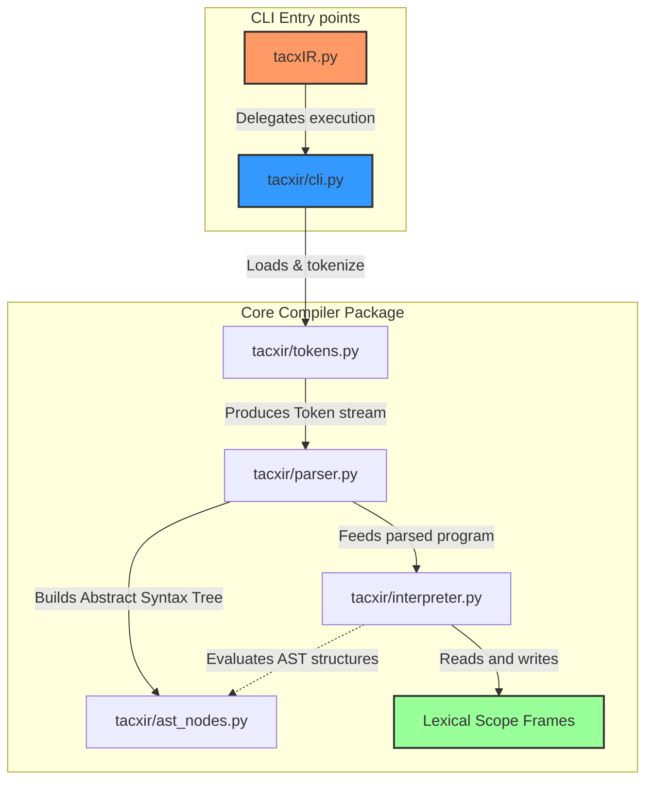

# 🏗️ Tacx.IR Project Structure & Architecture Guide

Welcome to the architectural blueprint of the **Tacx.IR** compiler package. This document details the physical layout of the repository, the responsibilities of individual modules, and the flow of data through the system.

---

## 📖 Table of Contents

1. [Physical File Layout](#-physical-file-layout)
2. [Architectural Diagram](#-architectural-diagram)
3. [Module Responsibilities](#-module-responsibilities)
    * [Compatibility Layer & Scripts](#compatibility-layer--scripts)
    * [Core Compiler Package (`tacxir/`)](#core-compiler-package-tacxir)
4. [Data & Execution Flow](#-data--execution-flow)
5. [Development Guidelines](#-development-guidelines)

---

## 📂 Physical File Layout

Below is the verified layout of the Tacx.IR project directory, mapping the relationship between the root entry points, documentation, tests, and modular source package:

```text
.
├── .gitignore                   # Ignore patterns for bytecode, cache, and CLI temp files
├── CHANGELOG.md                 # Unreleased milestones and change log records
├── CONTRIBUTING.md              # Extensive compiler workflow and code-standard guidelines
├── PROJECT_STRUCTURE.md         # [This File] Architectural blueprints and data flow
├── README.md                    # Core language reference, cheat sheet, and user manual
├── ROADMAP.md                   # Strategic language improvements and designs
├── tacxIR.py                    # Root entrypoint maintaining legacy backward-compatibility
├── test_tacxIR.py               # Regression test suite for robust validation
├── v2strengthtext.tacx          # Full-scale language strength validation script
└── tacxir/                      # Core Compiler & Interpreter Package
    ├── __init__.py              # Package init exporting clean, targeted public APIs
    ├── ast_nodes.py             # AST Class structures and tree-indented stringifiers
    ├── cli.py                   # Command Line Parsing interface, loaders, and runners
    ├── interpreter.py           # Evaluator, dynamic scope frames, and standard builtins
    ├── parser.py                # Precedence-aware recursive-descent syntax parser
    └── tokens.py                # Regex-based positional Lexer and tokenizer
```

---

## 🎨 Architectural Diagram

The diagram below illustrates how components interact, showing the separation between the root CLI shell interfaces and the interior compiler runtime environment:



---

## 🧩 Module Responsibilities

### Compatibility Layer & Scripts

#### [`tacxIR.py`](tacxIR.py)
* **Role**: Backward-compatible entrypoint in the root directory.
* **Details**: Keeps retro CLI execution syntax intact (e.g. `python tacxIR.py script.tacx`).
* **Exports**: Exposes primary APIs (`Parser`, `TacxIR`, `tokenize`, `main`) to test suites and older hooks without monolithic code clutter.

---

### Core Compiler Package (`tacxir/`)

#### [`tacxir/__init__.py`](tacxir/__init__.py)
* **Role**: Exports public classes, methods, and error definitions.
* **Details**: Imports and exposes core API hooks (`Token`, `tokenize`, `Parser`, `TacxIR`, `main`, etc.) keeping the modular folder structure invisible to top-level consumers.

#### [`tacxir/tokens.py`](tacxir/tokens.py) (The Lexer)
* **Role**: Lexical scanning and tokenization.
* **Details**: Stores `TOKEN_TYPES` matching string patterns into concrete `Token` instances. Automatically maps position indices to row/column coordinate offsets for runtime syntax messaging. **Keyword tokens are matched case-insensitively and normalized to lowercase values.**

#### [`tacxir/ast_nodes.py`](tacxir/ast_nodes.py) (The AST)
* **Role**: Abstract syntax node definitions.
* **Details**: Establishes individual classes for statements (e.g. `BoloStmt`, `RakhoStmt`) and expressions (e.g. `BinOpNode`, `VarNode`). Contains a helper rendering function `ast_to_debug_lines` generating beautifully formatted print dumps for `--dump-ast` queries.

#### [`tacxir/parser.py`](tacxir/parser.py) (The Parser)
* **Role**: Syntactic analysis and tree validation.
* **Details**: Processes raw tokens sequentially using recursive-descent parsing. Enforces mathematical precedence constraints (from logic operations down to simple numbers). Decodes escape sequence characters (like `\n`, `\t`) within string literal structures.

#### [`tacxir/interpreter.py`](tacxir/interpreter.py) (The Interpreter)
* **Role**: Evaluation engine.
* **Details**: Executes statement lists and evaluates expressions. Coordinates local function scopes, variables, and short-circuit operations. Raises clean control flow exception traps (`ReturnException`, `BreakException`, `ContinueException`) to manage structured loop constructs and call returns.

#### [`tacxir/cli.py`](tacxir/cli.py) (The Command Line Interface)
* **Role**: Input handler, stream setup, and runner.
* **Details**: Parses CLI flags via `argparse`. Sets up system console UTF-8 configurations. Routes execution to run code normally, print scanned token rows, or dump structured tree AST views.

---

## 🔄 Data & Execution Flow

When a source file is processed by Tacx.IR, data moves through these phases:

```text
  [ Source File ] 
         │
         ▼  (Read file contents via cli.py)
   "String Stream" 
         │
         ▼  (tokenize() inside tokens.py)
   [Token, Token, Token] 
         │
         ▼  (parse_program() inside parser.py)
   {AST Node Hierarchy} 
         │
         ▼  (execute() inside interpreter.py)
   [System Output / Print Stream]
```

1. **Loader Phase**: [`cli.py`](tacxir/cli.py) reads the raw script contents off the drive and reconfigures I/O encoding to prevent multi-byte UTF-8 crashes.
2. **Lexing Phase**: [`tokens.py`](tacxir/tokens.py) scans characters from left to right, filtering comments and spaces, producing a positional token array.
3. **Parsing Phase**: [`parser.py`](tacxir/parser.py) reads the token array, applying grammatical rules to generate an AST representation defined in [`ast_nodes.py`](tacxir/ast_nodes.py).
4. **Execution Phase**: [`interpreter.py`](tacxir/interpreter.py) walks the AST nodes recursively, managing scope states and writing outputs to standard output.

---

## 📏 Development Guidelines

* **Preserve Monolithic Decoupling**: Never add compiler parser rules or execution hooks directly back into the top-level script `tacxIR.py`.
* **Testing Integrity**: When adding or altering functionality, ensure coverage is immediately integrated into [`test_tacxIR.py`](test_tacxIR.py). Ensure the pipeline conforms to current conventions described in [`CONTRIBUTING.md`](CONTRIBUTING.md).
